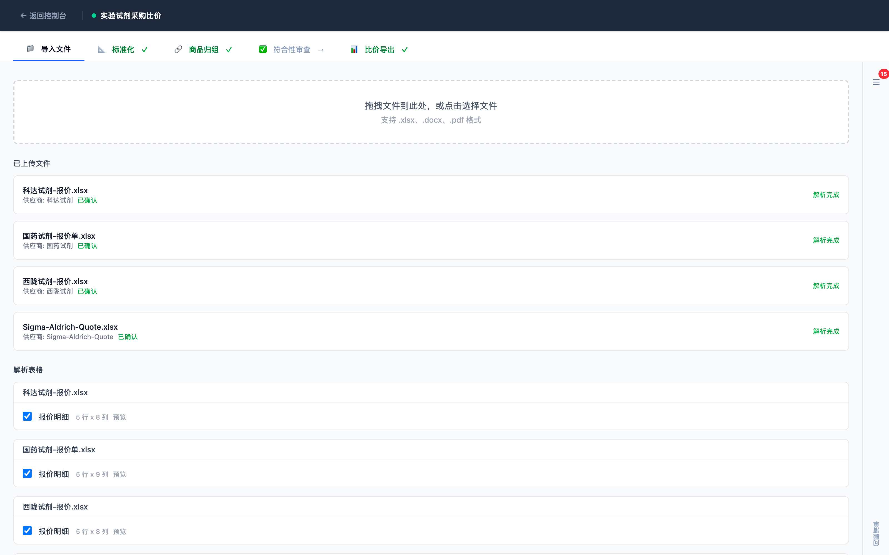
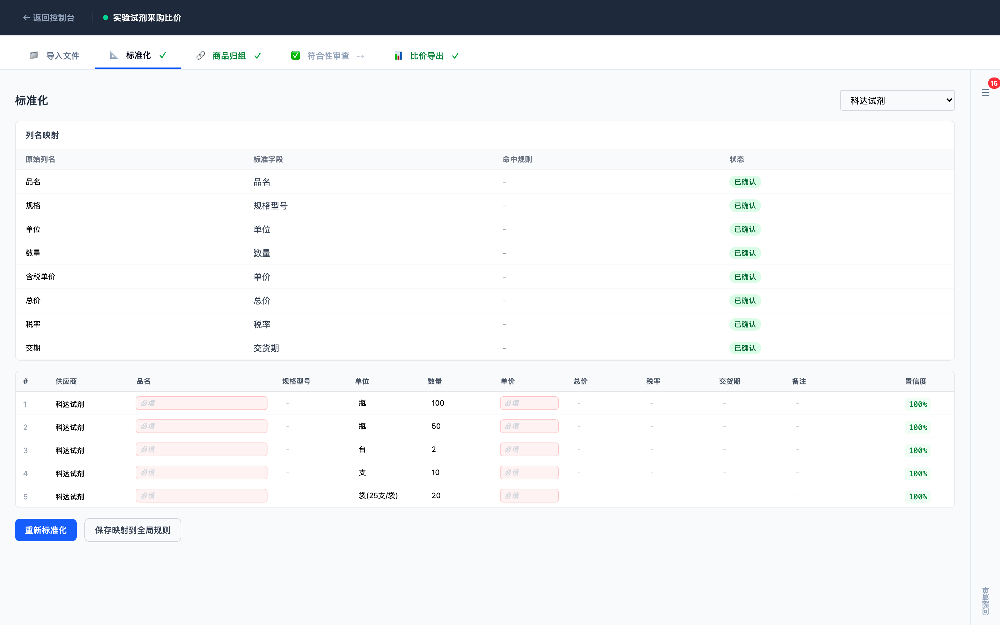
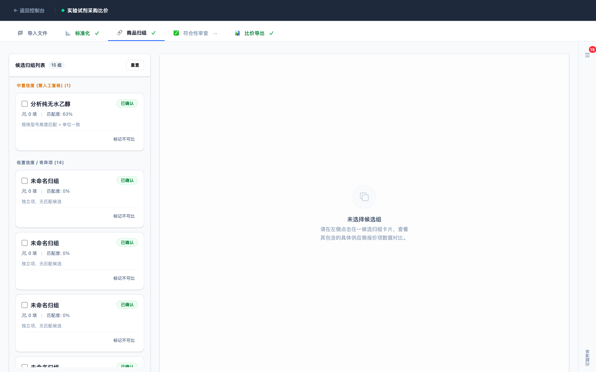
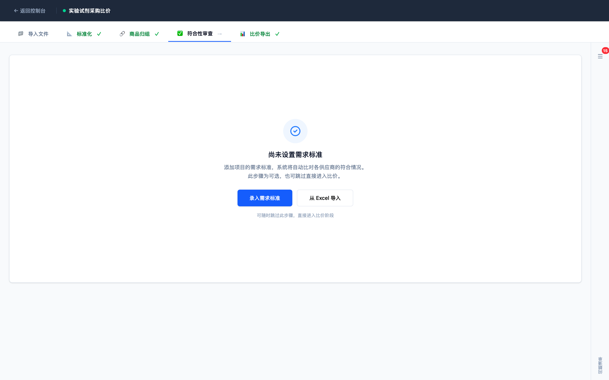
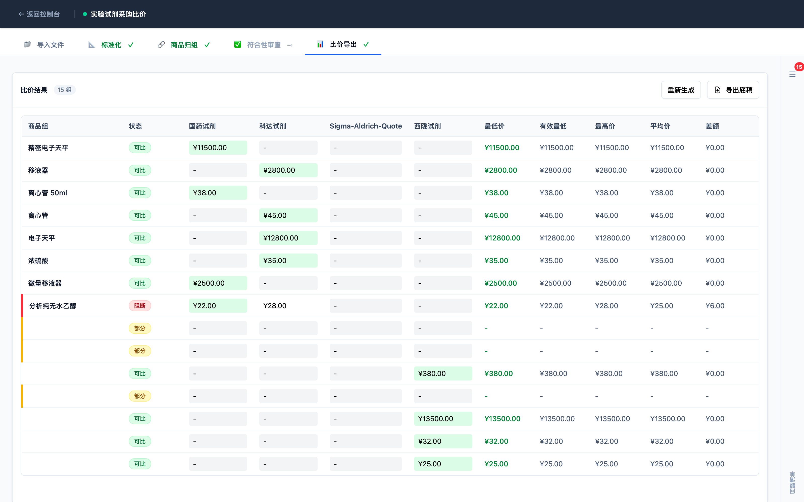
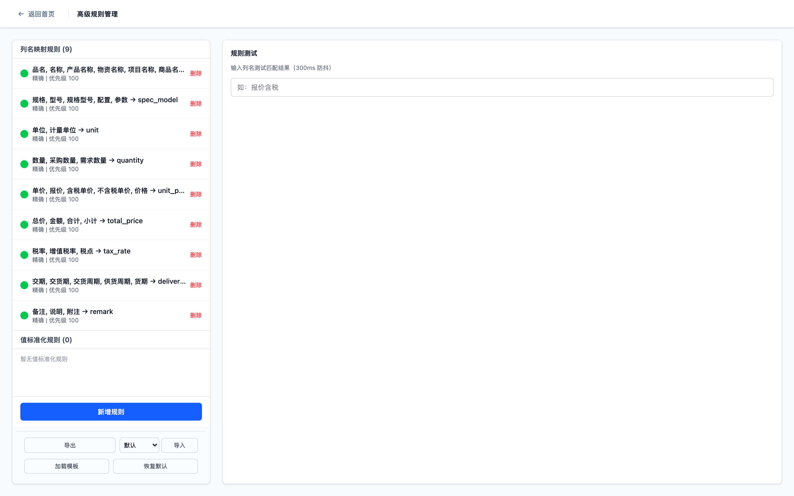
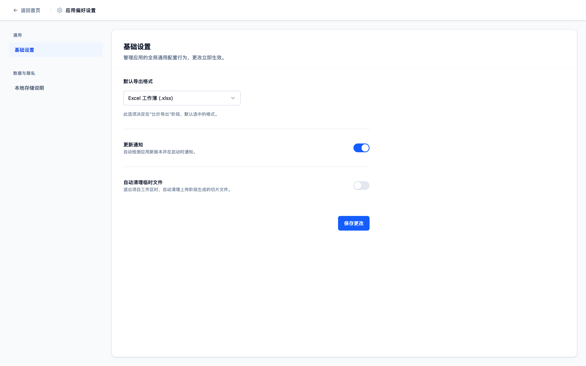
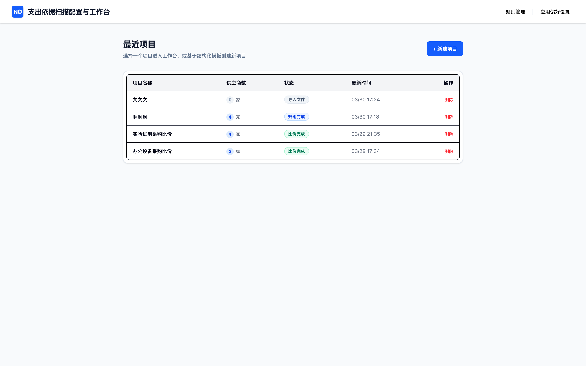
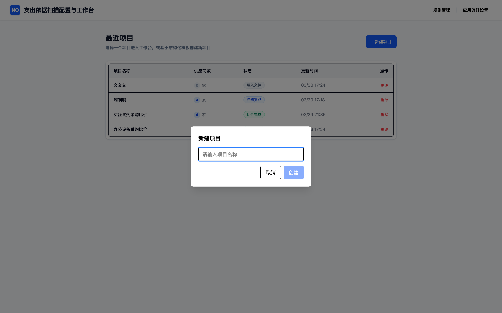
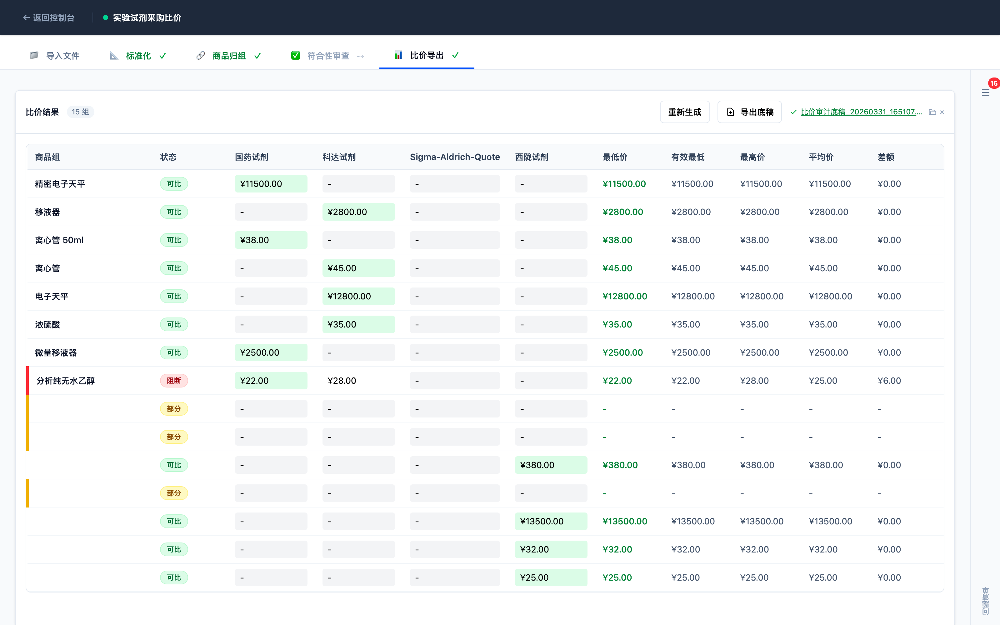

# 三方比价支出依据扫描工具

**面向采购、审计与财务场景的本地化三方比价审计辅助平台**

版本：v1.0
日期：2026-03-31

---

## 目录

1. [产品概述](#1-产品概述)
2. [建设背景与业务痛点](#2-建设背景与业务痛点)
3. [产品定位与应用场景](#3-产品定位与应用场景)
4. [核心功能总览](#4-核心功能总览)
5. [五阶段业务流程](#5-五阶段业务流程)
6. [关键产品亮点](#6-关键产品亮点)
7. [系统架构与运行方式](#7-系统架构与运行方式)
8. [数据安全与部署优势](#8-数据安全与部署优势)
9. [典型界面展示](#9-典型界面展示)
10. [交付成果与验收价值](#10-交付成果与验收价值)
11. [后续演进方向](#11-后续演进方向)

---

## 1. 产品概述

<!-- 来源参考：docs/requirements/PRD-MVP-v1.md §1 概述、§2 产品目标 -->
<!-- 截图需求：无（本章为文字执行摘要，限 1 页） -->

写作指导：

- **解释什么**：用 1 页以内说明产品是什么、解决什么问题、面向哪些用户、能带来什么价值，让非技术读者 30 秒内理解产品定位
- **来源**：PRD §1 项目背景、§2 产品目标；技术架构文档导语部分
- **截图需求**：无
- **风格要求**：先讲业务问题，再讲产品应对，语言克制专业，避免营销夸张语句

> TODO: 撰写执行摘要正文

---

## 2. 建设背景与业务痛点

<!-- 来源参考：docs/requirements/PRD-MVP-v1.md §1 背景与动因 -->
<!-- 截图需求：无 -->

写作指导：

- **解释什么**：从企业采购、审计、财务人员的实际工作场景出发，描述三方比价工作中存在的典型问题和痛点
- **来源**：PRD §1 建设背景；可参考 docs/app-verification-guide.md 中描述的典型工作流
- **内容要点**：多家供应商报价文件格式不统一；手工汇总比价效率低、易出错；过程留痕薄弱、事后追溯困难；合规性与证据管理要求日益严格
- **截图需求**：无

> TODO: 撰写业务痛点正文

---

## 3. 产品定位与应用场景

<!-- 来源参考：docs/requirements/PRD-MVP-v1.md §2 目标用户与使用场景 -->
<!-- 截图需求：无 -->

写作指导：

- **解释什么**：说明产品面向哪些角色、适用哪些业务场景，以及产品的能力边界（辅助工具定位，不替代采购决策）
- **来源**：PRD §2 目标用户（采购专员、审计人员、财务人员、项目经理）；§3 使用场景描述
- **内容要点**：典型角色列举；单项目采购比价场景；审计复核场景；财务报销留底场景；明确"不做"边界
- **截图需求**：无

> TODO: 撰写产品定位与应用场景正文

---

## 4. 核心功能总览

<!-- 来源参考：docs/requirements/PRD-MVP-v1.md §3 功能模块；docs/design/technical-architecture.md §4 核心引擎 -->
<!-- 截图需求：可选，功能模块示意表格或列表 -->

写作指导：

- **解释什么**：按用户视角（非系统内部模块视角）概述产品五大核心能力，让读者了解系统"能做什么"
- **来源**：PRD §3 功能清单；技术架构文档各引擎模块说明
- **内容要点**：文件导入与解析（PDF/Word/Excel 多格式）；字段标准化与人工修正；商品归组与人工确认；需求符合性审查（可选模块，需说明可选性）；比价结果生成与 Excel 导出
- **截图需求**：可选，若有功能模块概览图可插入此处

> TODO: 撰写核心功能总览正文

---

## 5. 五阶段业务流程

<!-- 来源参考：docs/design/technical-architecture.md §3 工作台五阶段流程 -->
<!-- 截图需求：03-import-stage.png、04-standardize-stage.png、05-grouping-stage.png、06-compliance-stage.png、07-comparison-stage.png，每阶段各一张 -->

写作指导：

- **解释什么**：完整说明从文件导入到比价导出的五个操作阶段，每阶段包括阶段目标、用户主要操作、系统自动处理内容、阶段结束条件
- **来源**：技术架构文档 §3 五阶段流程；PRD §3 各功能模块详细说明
- **内容要点**：阶段顺序是线性的，前置阶段完成才能进入下一阶段；每阶段均有人工修正入口
- **截图需求**：每个子章节配一张真实界面截图（共 5 张：03~07）

> TODO: 撰写五阶段流程导言（一段，介绍整体流程逻辑）

### 5.1 第一阶段：文件导入

<!-- 截图需求：03-import-stage.png（真实运行界面，优先级一） -->
<!-- 来源：PRD §3.1 文件导入模块；技术架构 DocumentParser 引擎 -->

写作指导：

- **解释什么**：用户如何上传多家供应商报价文件，系统如何识别格式并完成解析
- **来源**：PRD §3.1；技术架构 DocumentParser 引擎说明
- **截图需求**：`03-import-stage.png`（真实运行界面优先）

> TODO: 撰写文件导入阶段正文

### 5.2 第二阶段：字段标准化

<!-- 截图需求：04-standardize-stage.png（真实运行界面，优先级一） -->
<!-- 来源：PRD §3.2 标准化模块；技术架构 TableStandardizer 引擎 -->

写作指导：

- **解释什么**：系统如何将不同供应商的字段映射为统一格式，用户如何进行人工修正
- **来源**：PRD §3.2；技术架构 TableStandardizer 引擎；docs/app-verification-guide.md 标准化验证部分
- **截图需求**：`04-standardize-stage.png`（真实运行界面优先）

> TODO: 撰写字段标准化阶段正文

### 5.3 第三阶段：商品归组

<!-- 截图需求：05-grouping-stage.png（真实运行界面，优先级一） -->
<!-- 来源：PRD §3.3 商品归组模块；docs/design/commodity-grouping-algorithm.md -->

写作指导：

- **解释什么**：系统如何将不同供应商的同类商品识别并归为一组，用户如何通过拖拽调整并确认归组结果
- **来源**：PRD §3.3；归组算法文档 docs/design/commodity-grouping-algorithm.md；技术架构 CommodityGrouper 引擎
- **截图需求**：`05-grouping-stage.png`（真实运行界面优先）

> TODO: 撰写商品归组阶段正文

### 5.4 第四阶段：需求符合性审查

<!-- 截图需求：06-compliance-stage.png（真实运行界面，优先级一） -->
<!-- 来源：PRD §3.4 符合性审查模块；技术架构 ComplianceEvaluator 引擎 -->

写作指导：

- **解释什么**：系统如何对照采购需求规格评估各供应商报价的符合性，生成符合性矩阵；需说明本模块为可选功能
- **来源**：PRD §3.4；技术架构 ComplianceEvaluator 引擎说明；规则管理相关文档
- **截图需求**：`06-compliance-stage.png`（真实运行界面优先）

> TODO: 撰写需求符合性审查阶段正文

### 5.5 第五阶段：比价结果与导出

<!-- 截图需求：07-comparison-stage.png（真实运行界面，优先级一） -->
<!-- 来源：PRD §3.5 比价与导出模块；技术架构 PriceComparator 和 ReportGenerator 引擎 -->

写作指导：

- **解释什么**：系统如何生成比价结果表格、标注最低价（含税/不含税双口径），以及如何导出 Excel 审计底稿
- **来源**：PRD §3.5；技术架构 PriceComparator、ReportGenerator 引擎；docs/app-verification-guide.md 导出部分
- **截图需求**：`07-comparison-stage.png`（真实运行界面优先）

> TODO: 撰写比价结果与导出阶段正文

---

## 6. 关键产品亮点

<!-- 来源参考：docs/requirements/PRD-MVP-v1.md §4 产品特性；docs/design/technical-architecture.md §1 设计原则 -->
<!-- 截图需求：08-rule-management.png（配合符合性矩阵亮点说明） -->

写作指导：

- **解释什么**：提炼 5-7 个与竞品或手工流程相比的差异化亮点，以业务价值表达，而非技术实现描述
- **来源**：PRD §4 产品特性；技术架构 §1 设计原则（本地化、可追溯、可修正）
- **内容要点**：完全本地运行；全流程可追溯证据链；关键步骤支持人工修正；支持 PDF/Word/Excel 多格式；支持符合性矩阵；支持双口径最低价；支持审计底稿导出
- **截图需求**：`08-rule-management.png`（展示规则管理能力，配符合性矩阵亮点）

> TODO: 撰写关键产品亮点正文

---

## 7. 系统架构与运行方式

<!-- 来源参考：docs/design/technical-architecture.md §2 整体架构；CLAUDE.md 技术栈表 -->
<!-- 截图需求：无（本章以文字说明为主，可配架构示意文字图） -->

写作指导：

- **解释什么**：以外部读者可理解的方式（非代码层面）说明系统由哪些部分组成、它们如何协同工作
- **来源**：技术架构文档 §2 整体架构；CLAUDE.md 技术栈表格
- **内容要点**：Tauri 桌面壳负责界面渲染和窗口管理；React 前端提供交互界面；Python Sidecar 内嵌处理引擎；SQLite 本地项目数据库；前后端通过本地 HTTP 通信并携带会话令牌
- **截图需求**：无

> TODO: 撰写系统架构与运行方式正文

---

## 8. 数据安全与部署优势

<!-- 来源参考：docs/design/technical-architecture.md §安全设计；CLAUDE.md API 设计规范 -->
<!-- 截图需求：09-app-preferences.png（展示本地配置界面，辅助说明安全性） -->

写作指导：

- **解释什么**：从数据归属、访问控制、网络隔离三个角度说明产品的安全优势和部署适应性
- **来源**：技术架构文档安全设计章节；CLAUDE.md API 规范中绑定 127.0.0.1、禁止 0.0.0.0 的描述
- **内容要点**：所有数据本地存储，项目数据库文件可自主备份；无需联网，无外部 SaaS 依赖；仅监听本机地址，不暴露局域网；适合企业内网和敏感采购数据处理
- **截图需求**：`09-app-preferences.png`（展示应用设置界面，辅助说明本地化特性）

> TODO: 撰写数据安全与部署优势正文

---

## 9. 典型界面展示

<!-- 来源参考：真实运行界面截图（Task 5 采集） -->
<!-- 截图需求：01-home.png、02-create-project-dialog.png，以及其他关键界面截图 -->

写作指导：

- **解释什么**：以截图为主、文字为辅，集中展示产品界面成熟度，帮助读者形成直观认知
- **来源**：真实运行界面截图（Task 5 采集）；如暂缺则使用 docs/design/ui/*/screen.png 设计图补位
- **内容要点**：每张截图附一句解读；截图选取应覆盖首页、项目创建、核心工作台至少三个状态
- **截图需求**：`01-home.png`、`02-create-project-dialog.png`（必须）；其他截图视版面决定是否复用

> TODO: 撰写典型界面展示导言（一句话引入即可）

> TODO: 一句话解读首页界面（说明页面功能和用户价值）

> TODO: 一句话解读新建项目交互（说明操作流程起点）

---

## 10. 交付成果与验收价值

<!-- 来源参考：docs/requirements/PRD-MVP-v1.md §验收标准；docs/app-verification-guide.md -->
<!-- 截图需求：10-export-result.png（导出后 Excel 审计底稿或导出成功提示截图） -->

写作指导：

- **解释什么**：说明系统最终交付给用户的输出物是什么，以及这些输出物对采购验收和审计留底的价值
- **来源**：PRD §验收标准；docs/app-verification-guide.md 导出验证部分；backend/sample_projects/ 中的样例输出
- **内容要点**：比价结果表格（含最低价标注）；符合性矩阵报告；完整追溯信息与操作记录；Excel 审计底稿（可直接作为验收附件和留档证据）
- **截图需求**：`10-export-result.png`（真实导出结果截图优先）

> TODO: 撰写交付成果与验收价值正文

---

## 11. 后续演进方向

<!-- 来源参考：docs/requirements/PRD-MVP-v1.md §后续规划（如有）；OCR 模块说明 -->
<!-- 截图需求：无 -->

写作指导：

- **解释什么**：说明产品可预期的后续扩展方向，仅写已规划或明确可行的方向，不写未承诺能力
- **来源**：PRD 后续规划章节；CLAUDE.md 中 OCR 模块说明（实验性可选安装）
- **内容要点**：OCR 模块正式集成（当前为实验性可选安装，需在文中明确标注）；多项目批量管理能力；报价模板库积累与复用；审计报告格式扩展
- **截图需求**：无

> TODO: 撰写后续演进方向正文

---

*本白皮书基于系统已实现和已验证的功能编写，实验性功能已在相应章节明确标注。*
